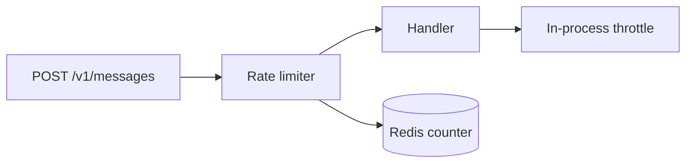

# Confirmation gates

Some Questions aren't asking the human to choose between designs — they are a
hard stop waiting on a yes. A commit-approval gate, or a gate before a finished
feature is landed, is the type case. Put these to the human too, and
preferentially: a gate is exactly the moment where finished work sits unlanded
until a human says so, which is the situation verkstead exists for.

A gate is a degenerate Set — one Question, proceed or don't. That makes the
`preface` do all the work: it carries what was built and what happens on a yes,
because the human is deciding without seeing the agent's session. The Diff the
CLI attaches is the rest of the evidence.

**Put a structure Diagram in it unless the change is trivial** — a few files, no
new relationships. Elsewhere a Diagram is one good option among several; here it
is the default, and prose is what needs the excuse. The Diff shows every line
that changed and nothing about the shape they add up to, and the shape is what a
gate is actually asking the human to approve.

- **Diagram the delta, not the system** — the components this change touches and
  the relationships between them, and nothing else. Tag each node with what
  happened to it: `new`, `modified` or `removed`. The viewer colours those from
  the same palette as the Diff below, so the picture and the patch read as one
  account of the change.
- **A before/after pair only when the change reshapes existing structure.** If
  it only adds, one Diagram with the new parts tagged says everything a pair
  would, at half the reading.
- **A sequence Diagram when the point is a new runtime flow** — who calls what,
  in what order — rather than a new arrangement of parts.

A delta Diagram for a gate on a rate limiter, where the counter moves out of the
process and the old throttle goes away:

What changes at a gate is how strictly the Response is read. An ordinary
Question is happy to come back partly answered; a gate is not:

- A selected *proceed* Option is approval.
- `unanswered: true` is **not** approval. It is the human declining to decide,
  and the gate stays shut.
- A `comment` or `free_text` that asks something back is a counter-question,
  not approval. Answer it, then put the same gate again.
- Anything ambiguous stays shut.

**Fail closed.** A gate that fails closed costs a round trip. A gate that fails
open commits or ships work nobody approved.
