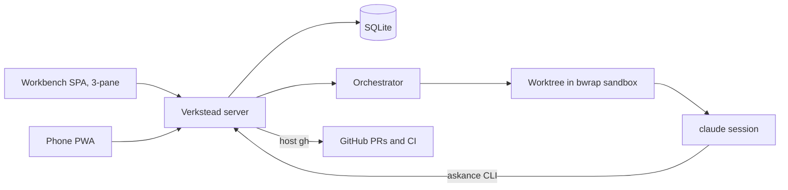

# Verkstead — design

Decided in the grilling session of 2026-08-20. This document is the durable
record of that session; the MVP roadmap under `docs/roadmaps/mvp/` references
it rather than restating it.

Verkstead (Norse *verk*, work + *stead*: a workshop) is a management platform
for agentic coding. Everything is driven from a web GUI; a background
orchestrator creates worktrees, runs and monitors sandboxed claude sessions,
puts question sets and commits to the human, and executes task lists and
staged roadmaps unattended. It replaces the combination of askance (question
channel), tobico-skills/roadrunner (workflow + driver), and tobico-scripts
(sandbox wrappers) with one product.

## Product decisions

- **A clone of askance, diverging freely.** Verkstead starts from askance's
  full history and keeps its architecture: Rust workspace + SolidJS SPA in one
  binary, SQLite store, SSE nudges, web push, server-side rendering of
  everything agent-written. *Why:* askance already holds the hard non-UI
  parts — store, push, PWA, markdown/diff/mermaid rendering — and the phone
  answering flow keeps working throughout the build.
- **askance remains a separate, maintained product.** No ongoing code sync, no
  shared crates, and **no wire-compatibility obligation** — Verkstead may
  break the `/api/v1` protocol whenever that helps.
- **Backend in Rust.** roadrunner's core (next-step decisions, git-observed
  done-signals, PTY session capture) is small, well-tested TypeScript; it gets
  ported into the server rather than run as a sidecar.
- **Frontend grows out of the existing SolidJS SPA**, becoming a fully
  responsive 3-pane workbench from day one (no desktop-only phase).
- **Private until it works.** Published as OSS later. Repo:
  `github.com/tobico/verkstead`.
- **NixOS-only for the MVP.** Linux/bwrap is a hard requirement; other systems
  can come later. Shipped like askance: one binary, NixOS module, systemd
  hardening.
- **Single user, no app-level auth; the tailnet is the perimeter.** Unchanged
  from askance.
- **Fresh database.** No import of askance history.

## Domain model

- **Watched paths** are configured in the environment at installation. They
  double as a security boundary: Verkstead refuses to operate on any file
  outside them. Repos are registered from within the watched paths.
- A **conversation** is the core entity: attached to a repo and a base commit,
  starting from a **brief** (an editable markdown document). The base commit
  defaults to the default branch's tip at grill start; overriding it is picking
  another of the repo's branches out of a dropdown, local or remote-tracking,
  which is stored by name and resolved at grill start the same way (*settled
  2026-08-24, building ui-refinements*: it took a typed commit before, resolved
  and pinned when it was typed). Each conversation owns one branch and one
  worktree; the branch name is prefilled randomly and customizable while the
  brief is drafted. Worktrees live under Verkstead's own data directory and
  are kept until the conversation is aborted — *corrected 2026-08-20, building
  stage 02*: this said "archived", and there is no archive action on a
  conversation. Aborting is what the teardown hangs off, and it leaves the
  branch alone.
- **Lifecycle:** Draft → Grilling → Direction → Implementing → Wrapping →
  Done. *Blocked on you* is a badge on any active state, not a state. A Done
  conversation can reopen with a new brief round. Aborting is possible from
  any state, and **Aborted** is a state of its own — off the ladder rather than
  on it, since every other state is somewhere the work has got to.
- **Agent profiles** are minimal: name, claude home dir + config file pair, the
  list of models that account can run — plus an agent-type discriminator so
  other backends can slot in later (claude is the only type now). The model
  list is the profile's own rather than one list shared by all of them, and it
  has no default entry: the profile says what is available and the pick is made
  where a session is set up. Account separation works as in the
  current scripts: the profile's pair is bind-mounted at `~/.claude` /
  `~/.claude.json` inside the sandbox.
- **Pairings.** What runs a conversation's sessions is a profile *and* one of
  that profile's models, picked together. Each conversation fixes **two** of
  them before grilling starts: one for grilling, one for implementation work
  (today's split: grill on fable, implement on opus). Every picker offers the
  pairings as one flat list, a row per profile-and-model combination — a
  two-stage profile-then-model picker was considered and rejected, since it
  costs a tap every time and the counts stay small. Both are fixed when
  grilling starts, alongside the branch, the base commit and the brief: what
  runs the work is settled before the work begins rather than swapped
  underneath it.
- **Sandbox configuration** (extra read-write binds such as build caches,
  network policy) lives in global defaults with per-repo overrides. *Settled
  2026-08-20, building stage 02*: it is configured where the watched paths are —
  `--sandbox-bind DIR` for every sandbox, `--sandbox-bind NAME=DIR` for the repo
  registered under that name — because each bind is a hole in the boundary and
  widening one is the installer's to do. Letting a **conversation** allow another
  repository into its own sandbox, chosen while the brief is drafted, is wanted
  and is not built: the sandbox takes a composed list, so it is a source to add
  rather than anything to undo.
- **Repo files stay the source of truth** for task lists (`.tasks/`) and
  roadmaps (`docs/roadmaps/`). Verkstead parses and renders them; it never
  owns them. *Why:* keeps the skills' formats and the done-signal design
  (a commit is the one report that can't be half made) intact.

## Workflow

- **Grilling.** "Start grilling" creates the branch + worktree and launches a
  grilling session under the conversation's grilling pairing. Question sets
  and captured output stream into the timeline. The agent proposes wrap-up as
  a final question set, carrying the direction chooser.
- **Direction.** The agent recommends inline / task list / staged roadmap with
  rationale; the human picks on that set, and the pick goes back to the
  still-living grilling session. That session then produces what was picked —
  the `.tasks/` backlog, the `docs/roadmaps/` staging, or (for **inline**) a
  handoff document — and the artifact landing plus quiet is what moves the
  conversation on. Inline needs the handoff because its builder is a fresh
  session under the implementation pairing: the grilling session cannot simply
  continue, the accounts differ (ADR-0008).
- **Two kinds of ask.** *Blocking* asks work as in askance: the session idles
  until the answer arrives. *Deferred* asks don't block; they sit in the
  timeline awaiting answers, which are folded into a later session's prompt.
  Work blocks **only** on questions whose answers affect upcoming work.
- **No commit gates.** The agent commits on its own; review happens later.
  Auto-advance runs the whole pipeline unattended: fresh session per task,
  tasks auto-advance, stages auto-continue, and the finish sequence (push +
  draft PR per the repo's review process) runs without approval. Merging stays
  a human act.
- **Wrap-up phase, per PR.** After a PR opens: the agent re-reviews the PR in
  a fresh context and raises a question set for any issues it finds;
  meanwhile Verkstead monitors the CI run and dispatches fix sessions on
  failure — **two fix attempts, then a blocking ask**. New PR comments (from
  the human or others) are detected by polling and auto-dispatch an
  addressing session. Commit feedback consolidates here: there are **no
  per-commit review states**; commits are viewable events, and the wrap-up
  phase is where problems get raised. The next stage starts only after
  wrap-up completes.
- **Stages always stack.** The next stage's branch stacks on the unmerged
  predecessor (`gh stack`), per the repo's stacked review process — *refined
  2026-08-21, building stage 04*: per the mechanism that repo **records**, in
  the `### Stacking roadmap stages` block of its `docs/agents/git-workflow.md`.
  Verkstead reads whether the block is there and the session follows what it
  says; a repo that records none gets a branch off the default branch, said on
  the timeline, because there is no convention to invent on its behalf.
- **The brief freezes at grill start.** A reopened round adds a new brief
  event rather than editing the old one. Until then it is edited where it
  stands, with no mode to enter and no Save to press (*settled 2026-08-24,
  building workbench-refit*): the field is always there, it grows with what is
  in it, and it keeps itself on a pause in the typing and on the way out of
  the field.
- **Interruptions** (crash, hang) become timeline events offering retry /
  take-over-manually / abort — roadrunner's remedies, GUI-native. The event is
  a plain openable card and the three are answered in the details pane, like a
  question set (*settled 2026-08-24, building workbench-refit*).
- **Usage limits.** When a claude account exhausts its window mid-run, the
  conversation pauses and push-notifies; it resumes on the human's say-so or
  when the window resets.
- **No cap on concurrent sessions** across conversations.

## Execution and sandboxing

- **bwrap, minimum surface**, evolved from `tobico-scripts/bin/sandbox`:
  - **rw:** the conversation's worktree; the repo's common `.git` directory;
    the profile's claude pair at `~/.claude` and `~/.claude.json`
  - **ro:** `/nix` and system paths
  - **tmpfs:** `/tmp`; everything else in HOME absent
  - `~` inside is the home of whoever runs the server, at the same path — the
    packaged unit says outright what that home is, `services.verkstead.home`,
    defaulting to `/var/lib/verkstead/home`, because systemd would otherwise
    derive `/var/empty` from the service user's passwd entry (*settled
    2026-08-20, building stage 02*). Nothing is read out of it any more
    (*refined 2026-08-23, building intentional-credentials*)
  - **Credentials and identity are said rather than found** (*settled
    2026-08-23, building intentional-credentials*): a token in `secrets.yaml`
    in the Data Directory, handed to each session as `GH_TOKEN`, which `gh`
    honours natively — so no gh files are inside a sandbox at all and the host's
    `~/.config/gh` is no longer bound in — and a `git_author` in `config.yaml`
    beside it, handed over as `GIT_CONFIG_COUNT` and the pairs it counts, which
    is also how the sandbox sets `gh auth git-credential` as the credential
    helper for `https://github.com` and rewrites SSH GitHub remotes to HTTPS so
    a push authenticates with the token instead of failing on absent keys, with
    `GIT_TERMINAL_PROMPT=0` so one that still cannot authenticate says so
    instead of asking a terminal nobody is at. The host's `~/.gitconfig` is no
    longer bound in either. Both files are read at every session spawn, so
    anything rotated applies from the next session; a missing, empty or
    unparseable file configures nothing rather than refusing to start, and with
    no author git's own "tell me who you are" stands. Both files are read and
    written through `/api/ui/settings` as well as by hand — the token
    write-only, coming back as its last four characters and the moment
    `secrets.yaml` was written, and a saved one verified against GitHub through
    the host `gh` so the answer names the account it authenticates as, or says
    in words why nobody could be asked. The save lands either way: a token is
    pasted once out of a page that will not show it again (*refined 2026-08-23,
    building intentional-credentials*).
  - per-repo extra binds from sandbox configuration
  - Nix dev-shell autodetection kept (wrap in `nix develop` only when a shell
    attribute actually evaluates)
  - This drops today's blanket rw bind of all of `~/src`.
- **Full network** inside the sandbox; filesystem is the boundary. Leave a
  seam for a proxy allowlist later.
- **The packaged unit's hardening opens exactly as far as a sandbox needs**,
  established by starting one under the unit rather than reasoned about:
  `RestrictNamespaces` narrowed to an allow-list of the namespaces bwrap
  creates — `net` stays denied — and `ProtectHostname`, `ProtectKernelLogs`,
  `ProtectKernelTunables` and `ProcSubset` dropped, the last three because each
  covers part of `/proc` and the kernel then refuses the sandbox its own.
  `MemoryDenyWriteExecute` goes too, for a reason that is not bwrap's: the
  filter is inherited by everything inside, and `claude` is node, which aborts
  where it cannot make what it wrote executable. `PrivateUsers`, an empty
  `CapabilityBoundingSet` and `ProtectProc` look like blockers and are not, so
  they stay. (*settled 2026-08-20, building stage 02*)
- **Question delivery:** the sandbox gets a conversation-scoped server base
  URL injected, so the bundled askance-lineage CLI attributes every set
  explicitly — no inference from project/branch. The variable is
  `VERKSTEAD_SERVER`: the session wrote `ASKANCE_SERVER` because the rename
  was not yet firm, and it was settled on 2026-08-20 in favour of renaming
  the whole agent-facing surface, since the real askance stays installed on
  the host.
- **Skills are bundled.** Verkstead ships its own adapted fork of the
  tobico-skills set (gates removed, wrap-up added) and installs it into each
  sandbox; `~/src/tobico-skills` is no longer bound in. *How, settled
  2026-08-20 building stage 02*: they ride inside the binary as the viewer
  does, are written out under the data directory at startup — replacing
  whatever an earlier binary left — and every sandbox binds that directory
  read-only over `~/.claude/skills`, hiding any the account itself keeps. What
  puts a session *inside* a skill is the prompt: installing one is not invoking
  one, and a sandbox has no global `CLAUDE.md` to say what the session is for,
  so the prompt names the skill by path above the Brief and the skill carries
  the ask instruction in its own text.
- **Verkstead itself reaches GitHub through host `gh`** (CI status, PR commit
  lists and comments), authenticating as the same configured token the sessions
  get — `GH_TOKEN` in the environment of each call, read from `secrets.yaml` at
  the moment of the call so a rotation applies without a restart, and unset
  where nothing is configured so the host's own login still stands (*refined
  2026-08-23, building intentional-credentials*). Agents keep using `gh` inside
  the sandbox for push/PR as today.
- **Full Captures** are stored per session; the timeline event summarizes
  (turn count + latest statement), the details pane shows everything. The turns
  are the session's own Transcript, counted as the pane draws them, and a
  session that keeps no log shows no count at all — a line count off the
  terminal read 0 for every session whose interface redraws itself (*refined
  2026-08-23, building agent-output-polish*).

## UI

Fully responsive 3-pane hierarchy: conversations list → timeline of the
selected conversation → details pane of the selected event.

The panes are resizable where they stand side by side (*settled 2026-08-24,
building workbench-refit*). Widths are shares of the window rather than fixed
lengths — what is traded away is a part of what this screen has, and no two
screens have the same — and the dividers between the panes drag: both of them
with all three panes up, the sidebar's alone with two. Each pane keeps a floor
so none can be dragged away, a double-click on a divider puts the defaults
back, and what a drag settles on is remembered per device. Below the two-pane
breakpoint the layout pages one pane at a time: no dividers, and nothing
remembered is read. The details pane caps its content at the 60rem the Set and
Settings pages are read at and centres it when the pane is wider, so a pane
dragged to the width of a window is still a pane a line can be read across.

The details pane is the selected Event and nothing else: with nothing selected
it is blank, and a narrow layout offers no way to page into it (*settled
2026-08-24, building workbench-refit*). What a Conversation needs settling
before it runs — branch, base commit, both Pairings, the readiness verdict —
rides under the Brief on its timeline card instead, disappearing entirely once
grilling starts, since the server freezes all of it at that moment. The repo
name, the worktree path and the conversation state are drawn nowhere: the
record tells that story.

Timeline events:

| Event | In timeline | In details pane |
|---|---|---|
| Brief | inline, always: a field that saves itself while drafting, a rendering once frozen; setup under it while drafting | — |
| Agent output | turn count, latest statement, liveness mark | Transcript or Screen |
| Question set | table of #, question, answer | full answer-set document |
| Commit | +/− and changed-line counts | server-rendered diff viewer |
| Task list | inline, pinned | — |
| Stage list | inline, pinned | — |
| PR | name + id, pinned | fetched commit list and comments |
| Interruption | what stopped, badge or chosen remedy | evidence, then the remedies as a sheet |
| Notice | inline, nothing to do about it | — |

- **An interruption is answered like a question set** (*settled 2026-08-24,
  building workbench-refit*): its card is a plain button carrying what stopped
  and either the *blocked on you* badge or the remedy chosen, and pressing
  anywhere on it opens the pane. The pane reads as an answer sheet — the
  evidence above, the three remedies as option rows under it, one note field and
  one submit — so nothing acts on a stray tap, which matters most for aborting
  and is anyway how answering already works. A settled one reads back the same
  way: the evidence, the remedy taken, and what was written alongside it.
- **Pinning is the fixed set** (task list, stage list, PR) with a floating
  summary box at the top of the timeline; no manual pin/unpin. More than one
  pinned card is a carousel rather than a stack (*settled 2026-08-24, building
  workbench-refit*): everything pinned is held above the record, so a stack of
  them is what the record gets pushed down by. Dots beneath say how many there
  are and which is showing, arrows over the card's edges turn it where there is
  a pointer, and a swipe across it does where there is not. What fronts on
  opening is the card the conversation is blocked on — a PR with feedback
  waiting — and otherwise the first of the fixed order; nothing is remembered
  between visits, and a single pinned card gets none of the furniture.
- **A session's liveness is a mark rather than a word**, and the same mark
  everywhere it is said — the sidebar card, the agent-output row and the
  details pane above the record. A slowly turning ring while the session is
  working, the same ring empty once it has gone quiet, and nothing at all once
  it is over; `prefers-reduced-motion` holds it still. Quiet is the server's
  judgement, three seconds with nothing printed, computed on every read and
  announced at both crossings — a session going quiet is exactly when it stops
  producing the nudges that would carry the news, and what carries it speaking
  again reaches the conversation being watched rather than the sidebar's list.
  On the card the waiting dot still outranks both rings, so a grilling sitting
  on an open set is drawn as waiting rather than as idle (*settled 2026-08-23,
  building agent-output-polish*).
- **A call and the answer to it are one card** (*settled 2026-08-24, building
  workbench-refit*): on the Transcript a tool call and the result answering it
  are a single fold — the tool and its one line while it is shut, what it was
  called with above what it said back once it is open. Two rows were two things
  to open for one thing that happened, and the second of them said *Result* and
  nothing else. Which two go together is the name the log gave the call, carried
  on both turns and joined by the pane rather than by the server, so a call whose
  tool is still running opens on its own and grows its answer where it stands.
  Success is quiet and a failure says *failed* in the summary line, in the
  stopped-run red — a session's one bad call is then findable without opening
  the ninety-nine good ones.
- **Starting work is one menu** (*settled 2026-08-24, building
  workbench-refit*): a button at the top of the sidebar drops the registered
  Repos, and the Repo pressed is the Conversation started. Under them, behind a
  rule, is *Adopt a roadmap* — every abandoned roadmap there is, flat and named
  with its Repo and the stage a press would start. Both were permanent
  furniture before: a form of three controls, and a stack of notices under it
  that the conversations were pushed down by. Nothing is waiting on the human
  in either, which is what says they belong behind a press — and the roadmaps
  are still not dismissible, because the group is in the menu every time it
  opens and a roadmap's score is the repository's to keep. The menu closes on a
  choice, on escape and on a press outside it, and hands the focus to the first
  Repo as it opens.
- **Sidebar is manually ordered**; conversations needing attention carry a
  marker icon and border.
- **Push notifications** for needs-you (blocking question sets, interruptions,
  usage-limit pauses) **and milestones** (PR opened, stage complete,
  conversation done).
- Question sets are answerable in the workbench and on the phone alike.
- **Everything the human configures is one page**, `/settings`, the one
  place the sidebar leads out to (*settled 2026-08-23, building
  intentional-credentials*). It opens on what Verkstead itself has been told —
  the GitHub token and the git author, saved together because the server writes
  both files in one request. The token field is write-only: what is shown of a
  saved one is its last four characters and when it was written, with replace
  and clear as presses of their own, and the account GitHub verified it as after
  a save. With either setting missing the page says so and says what it costs:
  sessions that cannot reach GitHub, commits that fail asking who the author is.
  Under the credentials are the Agent Profiles and the Repos, which had pages of
  their own until they were folded in here — all of it is settled once and then
  left alone, and `/profiles` and `/repos` are no such page now rather than
  redirects.

## Build and migration

Five stages, captured in `docs/roadmaps/mvp/`. The session planned four; the
Skeleton was split in two on 2026-08-20, when re-grounding at its start found
it combining a whole-repo rename with a process supervisor.

1. **Workbench** — rename; watched paths and repo registration;
   conversations, briefs and the 3-pane shell; agent profiles.
2. **Grilling** — worktrees and the bwrap sandbox; grilling sessions with
   Captures of what they printed; question sets in the timeline (blocking
   asks only).
3. **Implementation** — direction step, inline and task-list execution,
   commit events with diffs, auto-advance.
4. **Wrap-up** — PR events, gh integration, CI monitoring, the wrap-up loop,
   stacking, staged roadmaps.
5. **Refinement** — deferred asks, usage-limit pausing, manual sidebar
   ordering, milestone notifications, reopening rounds.

Adoption happens **after stage 4**, when Verkstead covers everything
roadrunner does. Until then roadrunner and the tobico-scripts wrappers stay
untouched and in daily use — and they are the toolchain that builds Verkstead
(this roadmap is executed with `/next-stage`). They retire once stage 3 lands.
