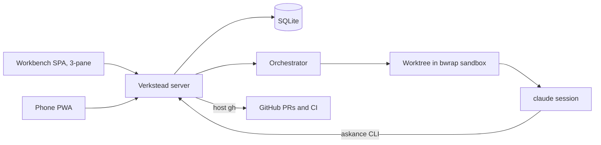

# Verkstead — design

Decided in the grilling session of 2026-08-20. This document is the durable
record of that session; the MVP roadmap under `docs/roadmaps/mvp/` references
it rather than restating it.

Verkstead (Norse *verk*, work + *stead*: a workshop) is a management platform
for agentic coding. Everything is driven from a web GUI; a background
orchestrator creates worktrees, runs and monitors sandboxed claude sessions,
puts question sets and commits to the human, and executes task lists and
staged roadmaps unattended. It replaces the combination of askance (question
channel), tobico-skills/roadrunner (workflow + driver), and tobico-scripts
(sandbox wrappers) with one product.

## Product decisions

- **A clone of askance, diverging freely.** Verkstead starts from askance's
  full history and keeps its architecture: Rust workspace + SolidJS SPA in one
  binary, SQLite store, SSE nudges, web push, server-side rendering of
  everything agent-written. *Why:* askance already holds the hard non-UI
  parts — store, push, PWA, markdown/diff/mermaid rendering — and the phone
  answering flow keeps working throughout the build.
- **askance remains a separate, maintained product.** No ongoing code sync, no
  shared crates, and **no wire-compatibility obligation** — Verkstead may
  break the `/api/v1` protocol whenever that helps.
- **Backend in Rust.** roadrunner's core (next-step decisions, git-observed
  done-signals, PTY session capture) is small, well-tested TypeScript; it gets
  ported into the server rather than run as a sidecar.
- **Frontend grows out of the existing SolidJS SPA**, becoming a fully
  responsive 3-pane workbench from day one (no desktop-only phase).
- **Private until it works.** Published as OSS later. Repo:
  `github.com/tobico/verkstead`.
- **NixOS-only for the MVP.** Linux/bwrap is a hard requirement; other systems
  can come later. Shipped like askance: one binary, NixOS module, systemd
  hardening.
- **Single user, no app-level auth; the tailnet is the perimeter.** Unchanged
  from askance.
- **Fresh database.** No import of askance history.

## Domain model

- **Watched paths** are said in two places and the boundary is the union of the
  two — the environment at installation, and the workbench settings (*revised
  2026-08-30, grilling configurable-paths*: this said "configured in the
  environment at installation", full stop). The installation's own are resolved
  once at startup and fail loudly, because a directory a unit named and has not
  got is a misconfiguration to report where it can be fixed; the settings' own
  are re-read at the moment an admission is decided and never fail at all, an
  entry that will not resolve simply covering nothing, with a word in the log.
  That is what lets a bare binary come up configured by nobody and be pointed at
  its first directory from its own settings page. They double as a security
  boundary either way: Verkstead refuses to operate on any file outside them,
  and watching nothing admits nothing. Repos are registered from within the
  watched paths. **Reading the names in a directory is outside the boundary's
  scope** (*revised 2026-09-02, grilling path-selector*: this said "refuses to
  operate on any file outside them", full stop) — see the path-selector bullet
  under **UI** for what browses where, and why the wider half of it was taken
  deliberately.
- A **conversation** is the core entity: attached to a repo and a base commit,
  starting from a **brief** (an editable markdown document). The base commit
  defaults to the default branch's tip at grill start; overriding it is picking
  another of the repo's branches out of a dropdown, local or remote-tracking,
  which is stored by name and resolved at grill start the same way (*settled
  2026-08-24, building ui-refinements*: it took a typed commit before, resolved
  and pinned when it was typed). Each conversation owns one branch and one
  worktree; the branch name is prefilled randomly and customizable while the
  brief is drafted — and the prefill is Verkstead's own name rather than one
  anybody chose, so a draft still carrying it is titled *Draft* everywhere and
  its branch field stands empty, the random name being drawn nowhere at all
  (*refined 2026-08-29, building optional-steps-and-auto-branch*). Worktrees
  live under Verkstead's own data directory and are kept until the conversation
  is closed — *corrected 2026-08-20, building stage 02*: this said "archived",
  and there is no archive action on a conversation. Closing is what the teardown
  hangs off, and it leaves the branch alone.
- **Lifecycle:** Draft → Grilling → Direction → Implementing → Wrapping →
  Done — or straight from Draft to Implementing where the human picked **No
  grilling**, the brief being the whole of the plan and an inline
  implementation what it goes to (*refined 2026-08-29, building
  optional-steps-and-auto-branch*).
  *Blocked on you* is a badge on any active state, not a state. Closing
  is possible from any state, and **Closed** is a state of its own — off the
  ladder rather than on it, since every other state is somewhere the work has
  got to. A conversation that is closed or Done is got back into by steering
  it, a steer into Grilling being what opens a new brief round (*refined
  2026-08-26, building close-and-retirements*). **Follow-up** sits beside the
  ladder the way Closed sits off it: a steer from Done or Wrapping, on work
  that is already on a pull request, opens a session the human asks and is
  asked in until they are finished with it. It ends when they tick **Nothing
  else** on the newest round they answer and the session goes idle with
  nothing left open; the conversation then re-enters Wrapping over the same
  pull request — with the checks put back to waiting where the follow-up
  pushed — and settles to Done the ordinary way (*added 2026-08-27, building
  follow-ups*).
- **The rescue.** A session that goes idle with nothing open and nothing to
  show for itself leaves a conversation nobody can move: the human sees only
  what arrives as a question set, and none has. So Verkstead types a canned
  line into the running session — the channel a watcher's keystrokes take —
  telling it to carry on where it has a next step and otherwise to summarize
  where it has got to and ask what to do next, as a set.
  The line and the enter after it are typed a moment apart, because an agent's
  terminal interface reads the two arriving together as a paste and a return
  inside a paste is a line break rather than a send. Twice at most; a session
  still saying nothing after the second stops the conversation with a notice
  saying it would not ask.
  Follow-up is where it started, the state where an idle session is exactly the
  failure (*added 2026-08-27, building follow-ups*). It now watches **every
  session Verkstead launches**, one loop with the state's own done-indicator as
  its parameter: a grilling's artifact, a backlog step's task file, an inline
  implementation's, an instruction's or a fix's commit, a follow-up's
  Nothing-else mark. A session
  with a set open is waiting on the human and one still printing is at work, so
  neither is ever spoken to; a fix session is ended rather than stopped over,
  the wrap-up's two goes at a check being the stop it already has (*refined
  2026-08-27, building follow-ups*). The inline session was the one the sweep
  left out, and it had no quiet ending either — so it is ended on committed plus
  quiet, the way the instruction session it is the same shape as always was
  (*refined 2026-08-27, reviewing follow-ups*). And it waits for a word after
  every **stir** — the session's launch, an answer arriving, a line it typed
  itself — because what carries an answer to a session is a chain of hops
  Verkstead can see none of, and one slower than the grace looked exactly like
  a session gone quiet: it interrupted a grilling that was working, which then
  sent the human a question set nobody needed. So the grace runs from the
  session's own first word after the stir rather than from the stir, with a
  five-minute ceiling for the one that died mid-wait and will never speak. The
  line is conditional for the same reason — carry on if you have a next step,
  ask only if you are blocked — so that a rescue typed on a guess that was
  wrong costs a quiet turn rather than a set on somebody's phone (*refined
  2026-08-29, refining rescues*).
- **Agent profiles** are minimal: name, claude home dir + config file pair, the
  list of models that account can run — plus an agent-type discriminator so
  other backends can slot in later. The model
  list is the profile's own rather than one list shared by all of them, and it
  has no default entry: the profile says what is available and the pick is made
  where a session is set up. Account separation works as in the
  current scripts: the profile's pair is bind-mounted at `~/.claude` /
  `~/.claude.json` inside the sandbox. *Which backends, settled 2026-08-29 in
  [ADR-0011](../adr/0011-agent-backends.md)*: Codex, Grok Build and OpenCode
  spend the other three slots, each at full parity. A new-type profile stores
  **one** home directory rather than claude's pair — the whole account lives
  under it — and the form offers a type only once its stage has landed.
- **Pairings.** What runs a conversation's sessions is a profile *and* one of
  that profile's models, picked together. Each conversation fixes **two** of
  them before grilling starts: one for grilling, one for implementation work
  (today's split: grill on fable, implement on opus) — *refined 2026-08-29,
  building optional-steps-and-auto-branch*: **three**, the wrap-up's review
  having a pairing of its own, because reviewing is a fresh set of eyes on
  what was built. Every other session a wrap-up dispatches is the work itself
  carrying on and runs under the implementation one. Every picker offers the
  pairings as one flat list, a row per profile-and-model combination — a
  two-stage profile-then-model picker was considered and rejected, since it
  costs a tap every time and the counts stay small. Two of the pickers carry a
  row that is not an account at all, **No grilling** and **No review**: picking
  one settles that role the way a pairing does and runs no session there (*same
  refinement*). All of them are fixed when the work starts, alongside the
  branch, the base commit and the brief: what runs the work is settled before
  the work begins rather than swapped underneath it. Each repo remembers the
  set it was last started with, so the next conversation on it arrives with
  every picker filled — a prefill the human may change, kept server-side so a
  phone and a desk share it.
- **Sandbox configuration** (extra read-write binds such as build caches,
  network policy) lives in global defaults with per-repo overrides. It is
  configured where the watched paths are — `--sandbox-bind DIR` for every
  sandbox, `--sandbox-bind NAME=DIR` for the repo registered under that name,
  and the same two grammars in the workbench settings (*revised 2026-08-30,
  grilling configurable-paths*; *settled 2026-08-20, building stage 02*, this
  was the installer's alone, because each bind is a hole in the boundary and
  widening one was held to be theirs). The two sets union the way the watched
  paths do, and each keeps its own answer to a bind that is not there: the
  flag's refuses startup, the setting's is skipped for that session with a line
  in the log. What makes the browser half safe is not that a bind stopped being
  a hole but that reaching the page is already reaching the machine — the
  tailnet is the perimeter and there is one human behind it — while a *phone* is
  no place to be told a typo cost every session in a repository its start. On a
  hardened nix install the unit's namespace still binds what the module was
  given, so a settings entry outside it saves, says on the page that the server
  cannot see it, and does nothing until the installer widens the unit. Letting a
  **conversation** allow another repository into its own sandbox is the
  companion-repos bullet below (*settled 2026-08-27, staging companion-repos*;
  this said "wanted and is not built"): the sandbox takes a composed list, so it
  was a source to add rather than anything to undo.
- **The shared Rust build cache was the first of these controls** and is still
  the only one that is on with nothing configured (*settled 2026-08-29,
  grilling shared-rust-build-cache*; it was written up as "the one deliberate
  exception" to an installer-only rule the bullet above no longer states —
  *revised 2026-08-30, grilling configurable-paths*). It is a hole the
  **server** opens in every sandbox by default, and the switch that closes it is
  in the workbench settings. It was taken on the rule that *a human should never
  have a worse experience for not having checked the settings*: every
  conversation cold-built otherwise, because `target/` is inside a worktree that
  is deleted on close and the cargo registry landed in a per-session tmpfs
  `$HOME`. What sets it apart from a `sandboxBinds` entry is still worth saying
  and is now about defaults rather than about who may configure it: this hole is
  one directory of Verkstead's own making, holding nothing but build output, so
  it can be opened for somebody who never asked and the only control over it is
  the one that *takes it away*. Every bind on the Paths pane is somebody else's
  directory, and is opened only because it was typed there.
- **Companion repos** (*settled 2026-08-27, staging companion-repos — being
  built by that roadmap*): a conversation may add other registered repos to its
  sandbox, each read-only or read-write. Configured while the brief drafts — an
  ellipsis menu beside the branch row (the one `Menu` component, extended to
  nest) adding a row per companion: a base-branch picker like the main one, a
  mode switch, and for read-write a branch-name field that mirrors the main
  branch name until one is typed. The conversation's own repo and duplicates
  are refused. Frozen at grill start with the branch and base, and read from
  then on off the Brief's details pane, which summarises the whole of a
  conversation's configuration — the worktree directories and the picked
  pairings included, neither of which is shown anywhere today. A steer may add
  companions or upgrade read-only to read-write — never remove or downgrade —
  and an upgrade fetches and cuts from the branch's fresh tip. **Always a
  Verkstead worktree; the human's checkout never enters a sandbox**: read-only
  checks out detached at the selected branch's resolved commit (which also
  sidesteps git's refusal to check a branch out twice), read-write always cuts
  a new branch, exactly as the main repo does. Fetch-then-resolve per companion
  at grill start, refusals naming the companion, teardown at close keeping the
  branches. The sandbox binds each companion's worktree and git common dir by
  mode and composes that repo's own per-repo binds; the prompt carries one
  neutral companion listing and no instructions — the agent decides from the
  brief what to use. Visibility: a commit sweep per read-write companion with
  repo-labeled commit events, and Set diffs composed server-side per repo (the
  main repo's diff derivation moves server-side too, for consistency).
  Pipeline: **full, per touched companion** — the finish session pushes and PRs
  each companion holding commits by that repo's own review process, a touched
  companion without a PR is a deliberate stop, each PR gets its own checks and
  comments watchers, one review session and one Set cover all the PRs, and Done
  waits for every PR to settle; the merge is still not waited on. Roadmap
  stages inherit the companion set, read-write branches named per stage.
- **Repo files stay the source of truth** for task lists (`.tasks/`) and
  roadmaps (`docs/roadmaps/`). Verkstead parses and renders them; it never
  owns them. *Why:* keeps the skills' formats and the done-signal design
  (a commit is the one report that can't be half made) intact.

## Workflow

- **Grilling.** "Start grilling" creates the branch + worktree and launches a
  grilling session under the conversation's grilling pairing — *refined
  2026-08-29, building optional-steps-and-auto-branch*: the button reads
  "Start work", one press covering both ways a conversation starts, and on
  **No grilling** the same press lands it Implementing with an inline session
  on the brief alone. Question sets
  and captured output stream into the timeline. The agent proposes wrap-up as
  a final question set, carrying the direction chooser.
- **Direction.** The agent recommends inline / task list / staged roadmap with
  rationale; the human picks on that set, and the pick goes back to the
  still-living grilling session. That session then produces what was picked —
  the `.tasks/` backlog, the `docs/roadmaps/` staging, or (for **inline**) a
  handoff document — and the artifact landing plus quiet is what moves the
  conversation on. Inline needs the handoff because its builder is a fresh
  session under the implementation pairing: the grilling session cannot simply
  continue, the accounts differ (ADR-0008).
- **Two kinds of ask.** *Blocking* asks work as in askance: the session idles
  until the answer arrives. *Deferred* asks don't block; they sit in the
  timeline awaiting answers, which are folded into a later session's prompt.
  Work blocks **only** on questions whose answers affect upcoming work.
- **No commit gates.** The agent commits on its own; review happens later.
  What the gate's summary did survives without it (*settled 2026-08-24,
  building commit-summaries; refined 2026-08-26, building design-fixes*): a
  code commit carries an agent-written summary as its message body — prose
  first, then the delta diagram the retired gates topic taught — and the sweep
  keeps the body (trailers stripped) so the commit's pane shows it as a headed
  Message above the diff and its card a clamped prose snippet.
  Bookkeeping commits (plans, roadmaps, the finish, ADRs) stay subject-only,
  and a commit without a summary draws as it always did.
  Auto-advance runs the whole pipeline unattended: fresh session per task,
  tasks auto-advance, stages auto-continue, and the finish sequence (push +
  draft PR per the repo's review process) runs without approval. Merging stays
  a human act. Every run ends on a PR and pushes after its last commit, so any
  of them — a backlog's finish, an inline implementation, a roadmap's own
  session — can land the whole of its work and still stop short of the PR.
  One that did gets a session sent for the PR alone, told the work is already
  built, and the stop is what is left if that leaves none either. Resume takes
  the same go rather than repeating the Notice: an empty `.tasks/` is read
  against the branch, which tells a backlog worked through from one that never
  landed.
- **Wrap-up phase, per PR.** After a PR opens: the agent re-reviews the PR in
  a fresh context and raises a question set for any issues it finds;
  meanwhile Verkstead monitors the CI run and dispatches fix sessions on
  failure — **two fix attempts, then a blocking ask**. A check that goes
  red while the review holds the Worktree folds into that session instead
  (*refined 2026-08-24, building propose-then-fix wrap-up*): the woken review
  reads the PR's check state with the answers and fixes what is failing beside
  the findings, spending none of the check's two attempts, because an attempt
  is what a dispatched session costs. New PR comments (from
  the human or others) are detected by polling and dispatch a batch session
  that **proposes before it fixes** (*refined 2026-08-24, building
  propose-then-fix wrap-up*): comments standing when the review starts go into
  the review's own set, and a batch said after it gets one session inside the
  bundled responding skill, which puts what it would do as its own small set
  and lands what the human accepts. A comment is the human saying what is
  wrong, not an instruction to a session. Each of those sets offers **every
  credible way of fixing a finding as an option of its own**, with leaving it
  alone always among them (*refined 2026-08-26, building wrapping-fix*), rather
  than a fix-it-or-leave-it pair. **Verkstead ends both kinds of session
  itself** (*refined 2026-08-26, building wrapping-fix*): every session is an
  interactive agent, which idles when its work is done rather than exiting, so
  the rule is quiet for a grace with no unanswered blocking ask of its own — a
  deferred ask holds nothing open — and waiting to see one exit was waiting for
  something that never came. **What a review left behind is read off the branch
  and the session, never off the record** (*settled 2026-08-26, building
  wrapping-fix*): the session that read the picks is the one that carried them
  out, so its ending cleanly is the whole of its report, a fresh `.tasks/`
  backlog on the branch is what sends spun-off work back to be built, and one
  that dies is a stop with Resume meaning the review over from the start.
  Nothing is dispatched from what was picked. Commit feedback consolidates here:
  there are **no
  per-commit review states**; commits are viewable events, and the wrap-up
  phase is where problems get raised. The next stage starts only after
  wrap-up completes.
- **Stages always stack.** The next stage's branch stacks on the unmerged
  predecessor (`gh stack`), per the repo's stacked review process — *refined
  2026-08-21, building stage 04*: per the mechanism that repo **records**, in
  the `### Stacking roadmap stages` block of its `docs/agents/git-workflow.md`.
  Verkstead reads whether the block is there and the session follows what it
  says; a repo that records none gets a branch off the default branch, said on
  the timeline, because there is no convention to invent on its behalf.
- **The brief freezes at grill start.** A later round adds a new brief
  event rather than editing the old one. Until then it is edited where it
  stands, with no mode to enter and no Save to press (*settled 2026-08-24,
  building workbench-refit*): the field is always there, it grows with what is
  in it, and it keeps itself whenever the typing stops for a moment and on the
  way out of the field.
- **A conversation is driven or it is stopped** (*settled 2026-08-24, building
  halt-and-resume; refined 2026-08-25, building one-stop; refined 2026-08-26,
  building close-and-retirements*). Whatever stopped it — a session that fell
  over, checks that would not go green, a driver a restart took away, an
  account out of usage window, a Stop the human pressed —
  Verkstead records the one stop on the conversation and writes a stop notice
  on its timeline saying what stopped, why, and what the evidence was. Nothing
  advances past a stop, and the status button says the conversation is waiting.
  Getting going again is one standing **Resume**, recomputed from the lifecycle
  and the branch rather than replaying whatever failed; steering the work is
  what **Steer** is for, so Resume carries nothing. It is the first row of the
  conversation actions menu (*refined 2026-08-30, building status-button*),
  above the stops because it is the one go among them — so it is reached from
  the button that says nothing is driving this, and from the sidebar's
  right-click, which drops the same rows. A follow-up is
  recomputed like everything else: a fresh session on the brief its steer
  opened it with and the rounds already answered, read off the timeline the way
  a relaunched grilling reads what it settled (*refined 2026-08-27, building
  follow-ups*). What replaced
  roadrunner's three remedies: retry is Resume, take over manually is the stop
  already standing, and abort is **Close**.
- **Usage limits.** When a claude account exhausts its window mid-run, the
  conversation stops the way every other stopped conversation does — one
  notice, one status, one Resume — and push-notifies. The reset time rides on
  the stop as words to read rather than as a moment anything acts on: no stop
  resumes itself, so this one waits for the same press (*refined 2026-08-25,
  building one-stop*). The words are on the status button's second line, where
  what is running is said — this being a stop with nothing running and a reason
  of its own for it (*refined 2026-08-30, building status-button*).
- **No cap on concurrent sessions** across conversations.

## Execution and sandboxing

- **bwrap, minimum surface**, evolved from `tobico-scripts/bin/sandbox`:
  - **rw:** the conversation's worktree; the repo's common `.git` directory;
    the profile's claude pair at `~/.claude` and `~/.claude.json`
  - **ro:** `/nix` and system paths
  - **tmpfs:** `/tmp`; everything else in HOME absent
  - `~` inside is the home of whoever runs the server, at the same path — the
    packaged unit says outright what that home is, `services.verkstead.home`,
    defaulting to `/var/lib/verkstead/home`, because systemd would otherwise
    derive `/var/empty` from the service user's passwd entry (*settled
    2026-08-20, building stage 02*). Nothing is read out of it any more
    (*refined 2026-08-23, building intentional-credentials*)
  - **Credentials and identity are said rather than found** (*settled
    2026-08-23, building intentional-credentials*): a token in `secrets.yaml`
    in the Data Directory, handed to each session as `GH_TOKEN`, which `gh`
    honours natively — so no gh files are inside a sandbox at all and the host's
    `~/.config/gh` is no longer bound in — and a `git_author` in `config.yaml`
    beside it, handed over as `GIT_CONFIG_COUNT` and the pairs it counts, which
    is also how the sandbox sets `gh auth git-credential` as the credential
    helper for `https://github.com` and rewrites SSH GitHub remotes to HTTPS so
    a push authenticates with the token instead of failing on absent keys, with
    `GIT_TERMINAL_PROMPT=0` so one that still cannot authenticate says so
    instead of asking a terminal nobody is at. The host's `~/.gitconfig` is no
    longer bound in either. Both files are read at every session spawn, so
    anything rotated applies from the next session; a missing, empty or
    unparseable file configures nothing rather than refusing to start, and with
    no author git's own "tell me who you are" stands. Both files are read and
    written through `/api/ui/settings` as well as by hand — the token
    write-only, coming back as its last four characters and the moment
    `secrets.yaml` was written, and a saved one verified against GitHub through
    the host `gh` so the answer names the account it authenticates as, or says
    in words why nobody could be asked. The save lands either way: a token is
    pasted once out of a page that will not show it again (*refined 2026-08-23,
    building intentional-credentials*).
  - per-repo extra binds from sandbox configuration
  - **A shared Rust build cache, on by default** (*settled 2026-08-29, grilling
    shared-rust-build-cache*): one directory the server resolves at startup —
    `--build-cache-dir`, `VERKSTEAD_BUILD_CACHE_DIR`, else
    `$XDG_CACHE_HOME/verkstead`; the packaged unit passes `/var/cache/verkstead`
    — bound writable at the same path inside, with `CARGO_HOME` in it so crates
    are downloaded once for the machine. It is the one directory outside the
    Data Directory Verkstead *creates*, because a feature on by default cannot
    ask for a `mkdir` first. Where the server resolved an `sccache` off its own
    `PATH` — which the module arranges by putting it on the service's path —
    that binary is bound read-only at `/verkstead/bin/sccache` and named
    absolutely as `RUSTC_WRAPPER`, with `SCCACHE_DIR` and `SCCACHE_CACHE_SIZE`
    beside it, so the compiling is cached too.

    **Verkstead runs the sccache server itself** (*settled 2026-08-29, reviewing
    shared-rust-build-cache*), in a sandbox of its own holding the worktrees
    directory and the cache and nothing else it keeps. An sccache server is
    what executes `rustc` — the client in a sandbox only hands it a command
    line — and every sandbox shares the host's network, so clients left to
    start their own all reach for one port: the session that lost the race has
    its compiles run inside the winner's sandbox, where its worktree is not
    bound, and the build **fails** rather than merely missing the cache
    (reproduced in a pair of sandboxes; `error: could not compile`). The
    worktrees directory whole rather than one worktree, so a conversation
    grilled later is one the running server can already compile for. Not on the
    host, because `rustc` runs proc macros while it compiles and the database
    and the settings files are in the Data Directory's root, outside the one
    bind it gets. Started before the first session of a conversation whose repo
    has a root `Cargo.toml`, so a machine that never builds Rust never runs one,
    and started again when the size changes because sccache reads it once.
    Without one it degrades rather
    than failing: the downloads are still shared, a startup line says the
    compiling is not, and the setup card warns on a repo with a root
    `Cargo.toml`. `CARGO_INCREMENTAL` is deliberately untouched — cargo builds
    dependencies non-incrementally already, which is exactly what sccache can
    cache, and the workspace's own crates stay incremental in the worktree's
    `target/`. A shared `CARGO_TARGET_DIR` was rejected: its lock serialises
    concurrent sessions and artifacts collide across feature sets. One global
    cache for every repo and every profile — cross-project poisoning was raised
    and accepted, sessions already sharing one uid and the whole host network.
    The switch and the size are `rust_build_cache` in `config.yaml`, read at
    every spawn, so a change applies to the next session; absent means on at
    30G. Named for Rust so a sibling can stand beside it later.
  - Nix dev-shell autodetection kept (wrap in `nix develop` only when a shell
    attribute actually evaluates)
  - This drops today's blanket rw bind of all of `~/src`.
- **Full network** inside the sandbox; filesystem is the boundary. Leave a
  seam for a proxy allowlist later.
- **The packaged unit's hardening opens exactly as far as a sandbox needs**,
  established by starting one under the unit rather than reasoned about:
  `RestrictNamespaces` narrowed to an allow-list of the namespaces bwrap
  creates — `net` stays denied — and `ProtectHostname`, `ProtectKernelLogs`,
  `ProtectKernelTunables` and `ProcSubset` dropped, the last three because each
  covers part of `/proc` and the kernel then refuses the sandbox its own.
  `MemoryDenyWriteExecute` goes too, for a reason that is not bwrap's: the
  filter is inherited by everything inside, and `claude` is node, which aborts
  where it cannot make what it wrote executable. `PrivateUsers`, an empty
  `CapabilityBoundingSet` and `ProtectProc` look like blockers and are not, so
  they stay. (*settled 2026-08-20, building stage 02*)
- **Question delivery:** the sandbox gets a conversation-scoped server base
  URL injected, so the bundled askance-lineage CLI attributes every set
  explicitly — no inference from project/branch. The variable is
  `VERKSTEAD_SERVER`: the session wrote `ASKANCE_SERVER` because the rename
  was not yet firm, and it was settled on 2026-08-20 in favour of renaming
  the whole agent-facing surface, since the real askance stays installed on
  the host.
- **Skills are bundled.** Verkstead ships its own adapted fork of the
  tobico-skills set (gates removed, wrap-up added) and installs it into each
  sandbox; `~/src/tobico-skills` is no longer bound in. *How, settled
  2026-08-20 building stage 02*: they ride inside the binary as the viewer
  does, are written out under the data directory at startup — replacing
  whatever an earlier binary left — and every sandbox binds that directory
  read-only over `~/.claude/skills`, hiding any the account itself keeps.
  *Where, refined 2026-08-29 in [ADR-0011](../adr/0011-agent-backends.md)*:
  the mount moves to `/verkstead/skills`, a path no backend owns, and an empty
  directory is bound over `~/.claude/skills` in its place so the hiding is
  kept. What
  puts a session *inside* a skill is the prompt: installing one is not invoking
  one, and a sandbox has no global `CLAUDE.md` to say what the session is for,
  so the prompt names the skill by path above the Brief and the skill carries
  the ask instruction in its own text.
- **Verkstead itself reaches GitHub through host `gh`** (CI status, PR commit
  lists and comments), authenticating as the same configured token the sessions
  get — `GH_TOKEN` in the environment of each call, read from `secrets.yaml` at
  the moment of the call so a rotation applies without a restart, and unset
  where nothing is configured so the host's own login still stands (*refined
  2026-08-23, building intentional-credentials*). Agents keep using `gh` inside
  the sandbox for push/PR as today.
- **Full Captures** are stored per session; the timeline event summarizes
  (turn count + latest statement), the details pane shows everything. The turns
  are the session's own Transcript, counted as the pane draws them, and a
  session that keeps no log shows no count at all — a line count off the
  terminal read 0 for every session whose interface redraws itself (*refined
  2026-08-23, building agent-output-polish*).

## UI

Fully responsive 3-pane hierarchy: pick, read, look into. On the workbench that
is conversations list → timeline of the selected conversation → details pane of
the selected event; on the settings it is the same conversations list → the
settings themselves → whichever of them is being rewritten.

**The frame is one shared component and both pages stand on it** (*settled
2026-08-29, building settings-redesign*): the grid, the dividers, the widths and
the one-pane walk are the frame's, and what stands in each pane is the page's.
The conversations list rides along everywhere because it is the app's navigation
rather than the workbench's furniture — configuring a machine is done *while*
work is going on, and a settings page that took the list away made the human
leave it to see whether anything had moved. The two pages share one pair of
remembered widths per device rather than a pair each.

The panes are resizable where they stand side by side (*settled 2026-08-24,
building workbench-refit*). Widths are shares of the window rather than fixed
lengths — what is traded away is a part of what this screen has, and no two
screens have the same — and the dividers between the panes drag: both of them
with all three panes up, the sidebar's alone with two. Each pane keeps a floor
so none can be dragged away, a double-click on a divider puts the defaults
back, and what a drag settles on is remembered per device. Below the two-pane
breakpoint the layout pages one pane at a time: no dividers, and nothing
remembered is read. The details pane caps its content at the 60rem the Set and
Settings pages are read at and centres it when the pane is wider, so a pane
dragged to the width of a window is still a pane a line can be read across.

The details pane is the one selected thing and nothing else: with nothing
selected it is blank, and a narrow layout offers no way to page into it
(*settled 2026-08-24, building workbench-refit*). That is nearly always an
Event; the backlog and the roadmap are the exceptions, being read off the
worktree rather than recorded, so their cards name them by a word where every
other card names an id — the roadmap carrying its own directory name, a worktree
being allowed any number of roadmaps where it has one `.tasks/`.

**Every details pane has a path of its own** (*settled 2026-08-29, building
settings-redesign*), nested under the Conversation — `events/:id`, `backlog`,
`roadmaps/:name` — or under `/settings` — `github`, `profiles/:id`, `repos/:id`,
with `new` standing where an id stands for the two that add one. The ids sit
behind a segment of their own so they can never be read as the panes named by a
word beside them. Selection is derived from the URL rather than held beside it,
so a pane survives being navigated away from and can be linked to. **Page-level
navigations push and detail changes replace**: entering a Conversation or the
settings is a page, walking between the details of one is not, so Back from a
details pane leaves what it was nested under rather than stepping back through
everything that was looked at.

**Opening a conversation lands on the end of its record** (*settled 2026-08-29,
building settings-redesign*): the last event that has a pane behind it is
selected and the URL is rewritten to its path, so the human arrives at where the
work got to. The *last openable* one, because a record very often ends on
something with nothing to show — a move, a manual task, a steer that carried no
document. It is the page's rather than the card's — the sidebar has no timeline
to pick from — and it happens only where the path names no pane already: a cold
load of a details pane keeps its own selection. The timeline follows its bottom
the way a running session's output does — pinned to the end until the human
scrolls up, and again once they come back down. A phone lands on the timeline
with the newest thing marked open, never carried past the record into the
details.

What a Conversation needs settling before it runs — branch, base commit, both
Pairings, the readiness verdict — rides under the Brief on its timeline card
instead, disappearing entirely once grilling starts, since the server freezes
all of it at that moment. The repo name, the worktree path and the conversation
state are drawn nowhere: the record tells that story.

Timeline events:

| Event | In timeline | In details pane |
|---|---|---|
| Brief | inline, always: a field that saves itself while drafting, a rendering once frozen; setup under it while drafting | — |
| Agent output | turn count, latest statement, liveness mark | Transcript or Screen |
| Question set | table of #, question, answer | full answer-set document |
| Commit | +/− and changed-line counts, clamped summary snippet | boxed Message (diagram drawn) above the server-rendered diff viewer |
| Task list | inline, pinned *and* on the record where the backlog landed | every task document, each a boxed markdown section in backlog order |
| Stage list | inline, pinned *and* on the record where the roadmap landed | every stage brief, each a boxed markdown section in roadmap order, done state on the heading |
| PR | name + id, pinned *and* on the record where it happened | fetched commit list and comments |
| Notice | inline, nothing to do about it | — |

- **A stop is a notice and nothing to answer** (*settled 2026-08-24, building
  halt-and-resume*): what stopped, why, and both blocks of evidence — the
  worktree as git saw it, and the tail of what the last session said — written
  as one markdown notice on the timeline. There is nothing on it to press,
  because there is nothing to decide about it: what the conversation is waiting
  on is the stop beside it, and Resume in the status button's menu is what
  answers that.
- **Pinning is the fixed set** (task list, stage list, PR) with a floating
  summary box at the top of the timeline; no manual pin/unpin. They come in one
  order and are drawn in it — **PR, then task list, then roadmap** (*settled
  2026-09-02, building pinned-carousel-order*): the PR leads as the one of the
  three with anything on it to answer, where the two lists are read off the
  worktree with nothing on them to do, and the lists follow in the order the work
  goes through them. The order is the server's, decided where the pinned list is
  built. More than one
  pinned card is a carousel rather than a stack (*settled 2026-08-24, building
  workbench-refit*): everything pinned is held above the record, so a stack of
  them is what the record gets pushed down by. Dots beneath say how many there
  are and which is showing, arrows over the card's edges turn it where there is
  a pointer, and a swipe across it does where there is not. What fronts on
  opening is the card the conversation is blocked on — a PR with feedback
  waiting — and otherwise the first of the fixed order; nothing is remembered
  between visits, and a single pinned card gets none of the furniture. A pinned
  card that is also a moment on the record is drawn in both places — one card,
  the same behaviour either way, and the same selection behind both — because a
  record with the moment folded out of it would be a record missing it. All
  three are: the PR at the moment the finish step opened it, and the two lists
  at the moment they landed on the branch (*settled 2026-08-26, building
  design-fixes*). The lists differ in where their content comes from — the row
  carries a stamp and nothing else, and the card at it is `.tasks/` or
  `docs/roadmaps/` read live at the moment somebody looks, exactly as the pinned
  copy is. Conversations from before the rows existed are not backfilled: they
  keep their pinned cards alone.
- **A checklist card shows five entries, not all of them** (*settled
  2026-08-28, building design-fixes*): the task list and the stage list window
  to five real entries centred on the first one that is not done, held inside
  the list's ends — none of ten done shows 1–5, five of ten shows 4–8, nine of
  ten shows 6–10, and a list with every box ticked shows its last five. A plain
  ellipsis row marks whichever end has entries out of sight, and does not count
  against the five. A card that grew with the backlog would push the record it
  is pinned above off the screen; the progress line on it still counts the whole
  list, and the details pane it opens still holds every entry, which is where
  the whole list is read.
- **A session's liveness is a mark rather than a word**, and the same mark
  everywhere it is said — the sidebar card, the agent-output row and the
  details pane above the record. A slowly turning ring while the session is
  working, the same ring empty once it has gone quiet, and nothing at all once
  it is over; `prefers-reduced-motion` holds it still. Quiet is the server's
  judgement, three seconds with nothing printed, computed on every read and
  announced at both crossings — a session going quiet is exactly when it stops
  producing the nudges that would carry the news, and what carries it speaking
  again reaches the conversation being watched rather than the sidebar's list.
  On the card the waiting dot still outranks both rings, so a grilling sitting
  on an open set is drawn as waiting rather than as idle (*settled 2026-08-23,
  building agent-output-polish*).
- **A call and the answer to it are one card** (*settled 2026-08-24, building
  workbench-refit*): on the Transcript a tool call and the result answering it
  are a single fold — the tool and its one line while it is shut, what it was
  called with above what it said back once it is open. Two rows were two things
  to open for one thing that happened, and the second of them said *Result* and
  nothing else. Which two go together is the name the log gave the call, carried
  on both turns and joined by the pane rather than by the server, so a call whose
  tool is still running opens on its own and grows its answer where it stands.
  Success is quiet and a failure says *failed* in the summary line, in the
  stopped-run red — a session's one bad call is then findable without opening
  the ninety-nine good ones.
- **Starting work is one menu** (*settled 2026-08-24, building
  workbench-refit*): a button at the top of the sidebar drops the registered
  Repos, and the Repo pressed is the Conversation started. Under them, behind a
  rule, is *Adopt a roadmap* — every abandoned roadmap there is, flat and named
  with its Repo and the stage a press would start. Both were permanent
  furniture before: a form of three controls, and a stack of notices under it
  that the conversations were pushed down by. Nothing is waiting on the human
  in either, which is what says they belong behind a press — and the roadmaps
  are still not dismissible, because the group is in the menu every time it
  opens and a roadmap's score is the repository's to keep. The menu closes on a
  choice, on escape and on a press outside it, and hands the focus to the first
  Repo as it opens.
- **Sidebar is manually ordered**; conversations needing attention carry a
  marker icon and border. At its head a gear opens the settings and reads as
  open while they are what is being looked at, and at its foot — pushed down by
  the room the list leaves over, so it stands against the bottom of a short list
  and after the last card of a long one — is the archived switch. Both were rows
  of a ⋯ menu until the gear replaced it (*settled 2026-08-29, building
  settings-redesign*): a menu of one way out and one switch is a press with a
  press in front of it, and the gear is the same kind of thing the cards below
  it are — something in this pane that is selected and opened into the pane
  beside it. The ⋯ at the head of a Conversation's timeline went the same way in
  the end, into the status button under the title: what there is to do about a
  Conversation is reached from the thing that says what it is doing (*settled
  2026-08-30, building status-button*). **And the timeline's own header says
  the Repo understated beside the branch it is titled by**, in the pattern the
  card that opened it draws its name and its Repo in — so the card and the
  header read as the one name said twice, and two drafts, both titled *Draft*,
  are told apart on the header by the only thing that differs (*settled
  2026-08-30, building status-button*).
- **Push notifications** for needs-you — a blocking question set, a stop
  Verkstead decided on, an exhausted usage window among them — **and
  milestones** (PR opened, stage complete, conversation done). A stop nobody
  chose sends nothing: a restart picks that one up unasked, so waking a phone
  about it would be asking for something that is already happening; neither
  does the human's own Stop, they being the one person it would be telling
  their own news (*settled 2026-08-24, building halt-and-resume; refined
  2026-08-25, building one-stop*).
- Question sets are answerable in the workbench and on the phone alike.
- **Everything the human configures is one page**, `/settings`, the one
  place the sidebar leads out to (*settled 2026-08-23, building
  intentional-credentials*). It opens on what Verkstead itself has been told —
  the GitHub token and the git author, saved together because the server writes
  both files in one request. The token field is write-only: what is shown of a
  saved one is its last four characters and when it was written, with replace
  and clear as presses of their own, and the account GitHub verified it as after
  a save. With either setting missing the page says so and says what it costs:
  sessions that cannot reach GitHub, commits that fail asking who the author is.
  Under the credentials are the Agent Profiles and the Repos, which had pages of
  their own until they were folded in here — all of it is settled once and then
  left alone, and `/profiles` and `/repos` are no such page now rather than
  redirects.
- **The page is read as cards and panes** (*settled 2026-08-29, building
  settings-redesign*). Everything on it that used to open a modal is a card in
  the middle pane and a details pane beside it: the credentials as one github
  card, each Agent Profile, each registered Repo — the shared Rust build cache,
  whose card says how it stands and whose pane holds the switch and the size,
  and **Paths**, whose card counts the watched paths and the global binds and
  whose pane edits both (*added 2026-08-30, grilling configurable-paths*). The
  Paths card sits directly above the Repos, because a watched path is what a
  Repo is registered from and a machine with none has nothing to put on that
  list; a Repo's own pane carries the binds said for its name under a **Sandbox
  configuration** heading, the same rows out of the same read and the same
  save, because a page listing every path would carry a column of `name=…`
  entries nobody could scan. **A bind written for a name no Repo is registered
  under goes back on the Paths pane**, because that split leaves it no pane of
  its own and a row drawn nowhere is a row nobody can take away — which is what
  unregistering a Repo makes of every bind said for it. The Paths card's count
  of entries the server cannot see spans a Repo's pane as well as its own, and
  says which to open: a bind that has quietly stopped resolving is what nobody
  goes looking for. What is on a card is what a list is scanned for
  and the rest is in the pane — a Profile's mounted paths, agent type and
  Remove; a Repo's branches, how much work is on it, what it is holding that
  nothing is driving and its own binds; the cache's switch and the size of its
  compiled half. Adding one is a plus icon on the section's heading line, which
  opens the same pane blank and reads as open while it stands. The two switches
  that are about the device and the server rather than about anything
  configured stay as they were: notifications on the pane head's line, and the
  update banner above everything.
- **A Repo can be taken off the registry** from its own pane (*settled
  2026-08-29, building settings-redesign*) — an unregistering rather than a
  delete, refused while live work is on it. See **Repo** in `CONTEXT.md` for
  what that means and what it leaves alone.
- **Every path is written into one field that browses** (*settled 2026-09-02,
  grilling path-selector*; this revises the stance three module headers stated,
  that a path is typed rather than picked because nothing scans a filesystem to
  offer choices from). The field is the text input it always was, extended with
  a drill-in dropdown: the rows are the entries of the deepest directory the
  text already names, a tap writes that path into the box and opens it, and the
  human closes the dropdown once the box holds what they want. There is no
  picking — closing is how a browse ends, so the box is always the choice and
  what a form sends is what the box holds, browsed or typed. It is served by one
  endpoint answering **one directory per request**, never a walk, because a
  browse is a level at a time and a tree nobody will read the whole of is not
  worth crossing a wire. Every refusal — relative, missing, not a directory,
  outside the boundary, unreadable — is a named outcome the dropdown draws where
  its rows would be rather than a status code, a field halfway through a word
  being the ordinary state of one.
- **The browse is bounded by whatever bounds the field's own value**, in two
  scopes. A field whose value the server refuses outside the Watched Paths —
  the path a Repo is registered from, an Agent Profile's account paths — browses
  inside them, opening on the roots themselves and stopping there on the way
  back out, decided by the same admission the save is about to make, so the
  dropdown cannot offer a wasted press. A field the boundary says nothing about
  — a Watched Path being added, a Sandbox Configuration bind — browses anywhere
  the server can read. **That second scope is a wider disclosure than anything
  else here makes and was taken deliberately**: a watched path is how the
  boundary is *said*, so a field bounded by it could only ever offer what is
  already watched, and reaching the page is already reaching the machine — the
  tailnet is the perimeter and there is one human behind it. What it discloses
  is a listing of names, and nothing outside a Watched Path is written, worked
  in or registered on the strength of it.

## Build and migration

Five stages, captured in `docs/roadmaps/mvp/`. The session planned four; the
Skeleton was split in two on 2026-08-20, when re-grounding at its start found
it combining a whole-repo rename with a process supervisor.

1. **Workbench** — rename; watched paths and repo registration;
   conversations, briefs and the 3-pane shell; agent profiles.
2. **Grilling** — worktrees and the bwrap sandbox; grilling sessions with
   Captures of what they printed; question sets in the timeline (blocking
   asks only).
3. **Implementation** — direction step, inline and task-list execution,
   commit events with diffs, auto-advance.
4. **Wrap-up** — PR events, gh integration, CI monitoring, the wrap-up loop,
   stacking, staged roadmaps.
5. **Refinement** — deferred asks, usage-limit pausing, manual sidebar
   ordering, milestone notifications, reopening rounds (*retired 2026-08-26,
   building close-and-retirements*: a steer into Grilling opens a round now).

Adoption happens **after stage 4**, when Verkstead covers everything
roadrunner does. Until then roadrunner and the tobico-scripts wrappers stay
untouched and in daily use — and they are the toolchain that builds Verkstead
(this roadmap is executed with `/next-stage`). They retire once stage 3 lands.
