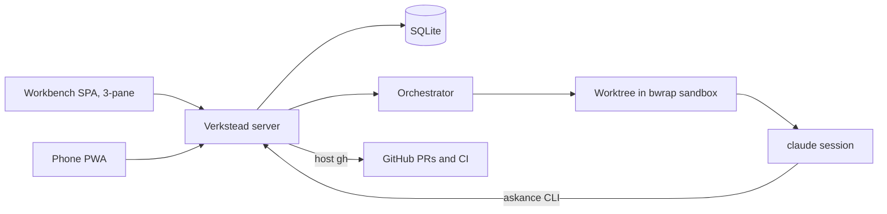

# Verkstead — design

Decided in the grilling session of 2026-08-20. This document is the durable
record of that session; the MVP roadmap under `docs/roadmaps/mvp/` references
it rather than restating it.

Verkstead (Norse *verk*, work + *stead*: a workshop) is a management platform
for agentic coding. Everything is driven from a web GUI; a background
orchestrator creates worktrees, runs and monitors sandboxed claude sessions,
puts question sets and commits to the human, and executes task lists and
staged roadmaps unattended. It replaces the combination of askance (question
channel), tobico-skills/roadrunner (workflow + driver), and tobico-scripts
(sandbox wrappers) with one product.

## Product decisions

- **A clone of askance, diverging freely.** Verkstead starts from askance's
  full history and keeps its architecture: Rust workspace + SolidJS SPA in one
  binary, SQLite store, SSE nudges, web push, server-side rendering of
  everything agent-written. *Why:* askance already holds the hard non-UI
  parts — store, push, PWA, markdown/diff/mermaid rendering — and the phone
  answering flow keeps working throughout the build.
- **askance remains a separate, maintained product.** No ongoing code sync, no
  shared crates, and **no wire-compatibility obligation** — Verkstead may
  break the `/api/v1` protocol whenever that helps.
- **Backend in Rust.** roadrunner's core (next-step decisions, git-observed
  done-signals, PTY session capture) is small, well-tested TypeScript; it gets
  ported into the server rather than run as a sidecar.
- **Frontend grows out of the existing SolidJS SPA**, becoming a fully
  responsive 3-pane workbench from day one (no desktop-only phase).
- **Private until it works.** Published as OSS later. Repo:
  `github.com/tobico/verkstead`.
- **NixOS-only for the MVP.** Linux/bwrap is a hard requirement; other systems
  can come later. Shipped like askance: one binary, NixOS module, systemd
  hardening.
- **Single user, no app-level auth; the tailnet is the perimeter.** Unchanged
  from askance.
- **Fresh database.** No import of askance history.

## Domain model

- **Watched paths** are configured in the environment at installation. They
  double as a security boundary: Verkstead refuses to operate on any file
  outside them. Repos are registered from within the watched paths.
- A **conversation** is the core entity: attached to a repo and a base commit,
  starting from a **brief** (an editable markdown document). The base commit
  defaults to the default branch's tip at grill start and is overridable per
  conversation. Each conversation owns one branch and one worktree; the branch
  name is prefilled randomly and customizable while the brief is drafted.
  Worktrees live under Verkstead's own state directory and are kept until the
  conversation is archived.
- **Lifecycle:** Draft → Grilling → Direction → Implementing → Wrapping →
  Done. *Blocked on you* is a badge on any active state, not a state. A Done
  conversation can reopen with a new brief round. Aborting is possible from
  any state.
- **Agent profiles** are minimal: name, claude home dir + config file pair,
  default model — plus an agent-type discriminator so other backends can slot
  in later (claude is the only type now). Account separation works as in the
  current scripts: the profile's pair is bind-mounted at `~/.claude` /
  `~/.claude.json` inside the sandbox. Each conversation fixes **two**
  profiles before grilling starts: one for grilling, one for implementation
  work (today's split: grill on fable, implement on opus).
- **Sandbox configuration** (extra read-write binds such as build caches,
  network policy) lives in global defaults with per-repo overrides.
- **Repo files stay the source of truth** for task lists (`.tasks/`) and
  roadmaps (`docs/roadmaps/`). Verkstead parses and renders them; it never
  owns them. *Why:* keeps the skills' formats and the done-signal design
  (a commit is the one report that can't be half made) intact.

## Workflow

- **Grilling.** "Start grilling" creates the branch + worktree and launches a
  grilling session under the conversation's grilling profile. Question sets
  and captured output stream into the timeline. The agent proposes wrap-up as
  a final question set; answering it moves the conversation to Direction.
- **Direction.** The agent recommends inline / task list / staged roadmap with
  rationale; the human chooses in the GUI. **Inline** means a fresh session
  under the implementation profile, primed with a handoff document the
  grilling session writes (the grilling session cannot simply continue — the
  profiles differ).
- **Two kinds of ask.** *Blocking* asks work as in askance: the session idles
  until the answer arrives. *Deferred* asks don't block; they sit in the
  timeline awaiting answers, which are folded into a later session's prompt.
  Work blocks **only** on questions whose answers affect upcoming work.
- **No commit gates.** The agent commits on its own; review happens later.
  Auto-advance runs the whole pipeline unattended: fresh session per task,
  tasks auto-advance, stages auto-continue, and the finish sequence (push +
  draft PR per the repo's review process) runs without approval. Merging stays
  a human act.
- **Wrap-up phase, per PR.** After a PR opens: the agent re-reviews the PR in
  a fresh context and raises a question set for any issues it finds;
  meanwhile Verkstead monitors the CI run and dispatches fix sessions on
  failure — **two fix attempts, then a blocking ask**. New PR comments (from
  the human or others) are detected by polling and auto-dispatch an
  addressing session. Commit feedback consolidates here: there are **no
  per-commit review states**; commits are viewable events, and the wrap-up
  phase is where problems get raised. The next stage starts only after
  wrap-up completes.
- **Stages always stack.** The next stage's branch stacks on the unmerged
  predecessor (`gh stack`), per the repo's stacked review process.
- **The brief freezes at grill start.** A reopened round adds a new brief
  event rather than editing the old one.
- **Interruptions** (crash, hang) become timeline events with retry /
  take-over-manually / abort actions in the GUI — roadrunner's remedies,
  GUI-native.
- **Usage limits.** When a claude account exhausts its window mid-run, the
  conversation pauses and push-notifies; it resumes on the human's say-so or
  when the window resets.
- **No cap on concurrent sessions** across conversations.

## Execution and sandboxing

- **bwrap, minimum surface**, evolved from `tobico-scripts/bin/sandbox`:
  - **rw:** the conversation's worktree; the repo's common `.git` directory;
    the profile's claude pair at `~/.claude` and `~/.claude.json`
  - **ro:** `/nix` and system paths, `~/.gitconfig`, gh config
  - **tmpfs:** `/tmp`; everything else in HOME absent
  - per-repo extra binds from sandbox configuration
  - Nix dev-shell autodetection kept (wrap in `nix develop` only when a shell
    attribute actually evaluates)
  - This drops today's blanket rw bind of all of `~/src`.
- **Full network** inside the sandbox; filesystem is the boundary. Leave a
  seam for a proxy allowlist later.
- **Question delivery:** the sandbox gets a conversation-scoped
  `ASKANCE_SERVER` base URL injected, so the bundled askance-lineage CLI
  attributes every set explicitly — no inference from project/branch.
- **Skills are bundled.** Verkstead ships its own adapted fork of the
  tobico-skills set (gates removed, wrap-up added) and installs it into each
  sandbox; `~/src/tobico-skills` is no longer bound in.
- **Verkstead itself reaches GitHub through host `gh`** (CI status, PR commit
  lists and comments), reusing existing auth. Agents keep using `gh` inside
  the sandbox for push/PR as today.
- **Full transcripts** are stored per session; the timeline event summarizes
  (line count + latest statement), the details pane shows everything.

## UI

Fully responsive 3-pane hierarchy: conversations list → timeline of the
selected conversation → details pane of the selected event.

Timeline events:

| Event | In timeline | In details pane |
|---|---|---|
| Brief | inline, always | — |
| Agent output | line count + latest statement | full transcript |
| Question set | table of #, question, answer | full answer-set document |
| Commit | +/− and changed-line counts | server-rendered diff viewer |
| Task list | inline, pinned | — |
| Stage list | inline, pinned | — |
| PR | name + id, pinned | fetched commit list and comments |
| Interruption | inline with remedy actions | session tail / evidence |

- **Pinning is the fixed set** (task list, stage list, PR) with a floating
  summary box at the top of the timeline; no manual pin/unpin.
- **Sidebar is manually ordered**; conversations needing attention carry a
  marker icon and border.
- **Push notifications** for needs-you (blocking question sets, interruptions,
  usage-limit pauses) **and milestones** (PR opened, stage complete,
  conversation done).
- Question sets are answerable in the workbench and on the phone alike.

## Build and migration

Four stages, captured in `docs/roadmaps/mvp/`:

1. **Skeleton** — rename; conversations, briefs, repo registration, agent
   profiles; sandboxed grilling sessions; question sets and transcripts in
   the timeline (blocking asks only).
2. **Implementation** — direction step, inline and task-list execution,
   commit events with diffs, auto-advance.
3. **Wrap-up** — PR events, gh integration, CI monitoring, the wrap-up loop,
   stacking, staged roadmaps.
4. **Refinement** — deferred asks, usage-limit pausing, manual sidebar
   ordering, milestone notifications, reopening rounds.

Adoption happens **after stage 3**, when Verkstead covers everything
roadrunner does. Until then roadrunner and the tobico-scripts wrappers stay
untouched and in daily use — and they are the toolchain that builds Verkstead
(this roadmap is executed with `/next-stage`). They retire once stage 3 lands.
